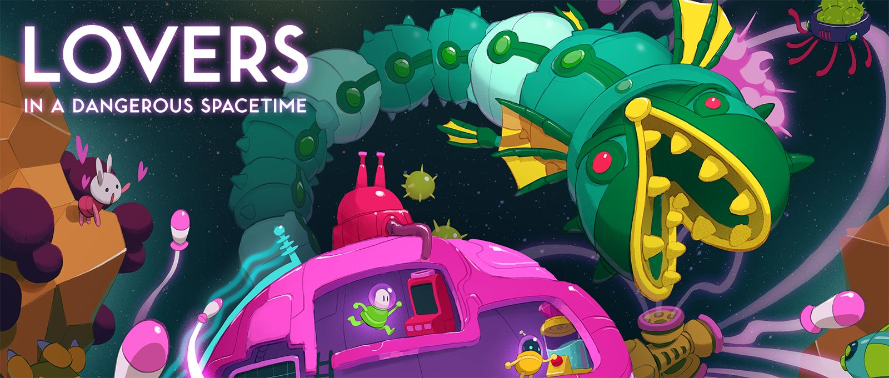
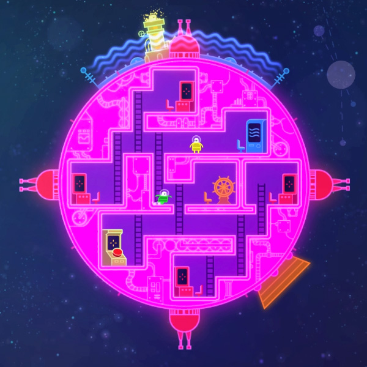
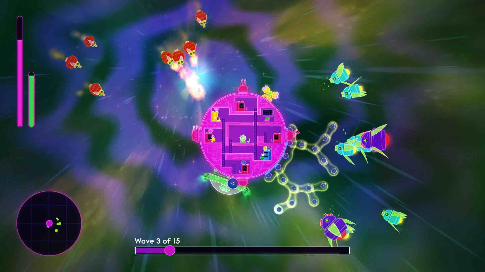
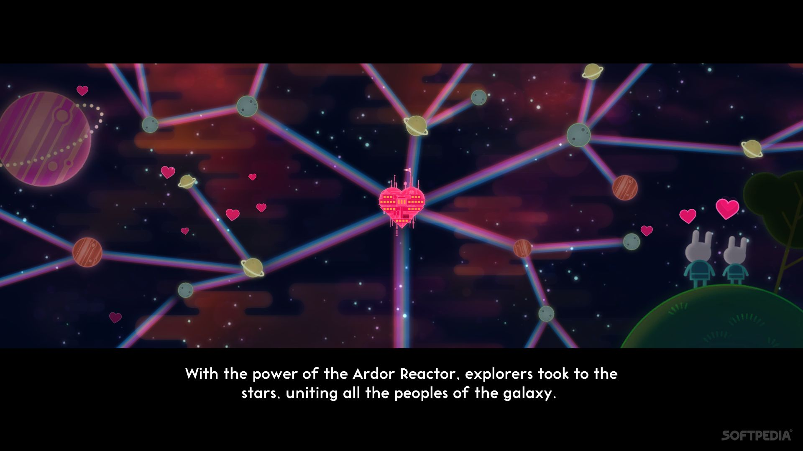

# Game Analysis: _Lovers in a Dangerous Spacetime_

## Contextualization

_Lovers in a Dangerous Spacetime_ is a video game released in 2015. 
It was developed by Asteroid Base which is a Toronto-based indie studio that is made up of 3 friends: Matt Hammill, Jamie Tucker, and Adam Winkels. 
Additionally, Ryan Henwood composed the music for this game.
Matt Hammill once said that the development of this game was "almost an accident". 
The team had just the intention of making a game for a 3-day game jam. 
After the game jam, however, the team wanted to continue developing the project and so _Lovers in a Dangerous Spacetime_ became an actual long-term project.
What began as a short experimental project evolved into a full-scale release, reflecting the studio’s commitment to collaborative and experimental design.

_Lovers in a Dangerous Spacetime_ is an action space shooter that can be played single-player (with a dog companion to help out) or multiplayer.
Players control small characters inside a circular spaceship, operating different stations such as turrets, shields, 
and thrusters in order to fight enemies and rescue captured creatures scattered throughout each level.
Traditionally, space shooters are fast-paced and action-oriented games that position the player as a singular pilot in full control of a spacecraft. 
The player typically manages movement, aiming, and firing simultaneously, emphasizing reflexes, efficiency, and technical mastery. 
These games often centralize control in one character, reinforcing a power fantasy built around domination and survival against waves of enemies. 
Visually, many space shooters lean toward militaristic or industrial aesthetics—featuring metallic ships, dark color palettes, and themes of combat and destruction.

By contrast, _Lovers in a Dangerous Spacetime_ was released during the mid-2010s, 
a period in which independent developers were contributing to a revival of local “couch co-op” games. 
After years in which online multiplayer dominated the industry, many indie titles began re-emphasizing shared-screen cooperative play, 
encouraging players to occupy the same physical space and communicate directly. 
This revival highlighted collaboration over competition and foregrounded social interaction as a core element of gameplay.

Within its genre and historical context, _Lovers in a Dangerous Spacetime_ stands out through its focus on cooperative play, 
but also in the way it reimagines the genre of the space shooter itself.
**Through its core mechanic of decentralized control, _Lovers in a Dangerous Spacetime_ forces players to cooperate, communicate, and coordinate within structured chaos, 
reinventing the traditionally centralized space shooter genre, an inversion reinforced by its bright, playful aesthetics.** 

## Decentralized Control and Spatial Design

First of all, at the core of _Lovers in a Dangerous Spacetime_  is the mechanic that fundamentally transforms the structure of 
how players interact with the spaceship itself. Unlike traditional space shooters where a single player pilots and controls every single function of their spacecraft simultaneously,
this game deliberately separates control across the multiple stations within the ship's interior.
These stations include turrets for attacking enemies, a shield used to block incoming projectiles, an engine that controls the ship’s movement, 
and a navigation station that allows players to view the map and chart a course through each level.

While players are able to unlock several variations of the ship layout as they progress through the game, 
every ship contains the same basic functional stations.
Four turret stations are positioned around the circular ship, each controlling a weapon that fires in a specific quadrant.
The engine station propels the ship forward and determines its movement through space, while the shield station allows players 
to rotate a protective barrier around the exterior of the ship to block enemy attacks. 
There is also a special powerful canon/beam with a cooldown for getting out of tough spots.
Finally, the navigation station displays the level map, helping players locate objectives and trapped creatures that must be rescued.

Because each station can only be operated by a single character at a time and the fact that there are more stations that players, 
players must physically run between them in order to react to different threats. 
When enemies approach from a new direction, players may need to abandon one station and quickly move to another to fire a weapon or activate the shield. 
As a result, no single player can control the entire ship at once. 
Instead, the design forces players to constantly redistribute responsibilities, creating a system in which 
movement within the ship’s interior becomes an essential part of operating the spacecraft itself.
Additionally, the delay caused by the need to move your character between stations across the ship creates a powerful sense of urgency and chaos.

## Cooperation as a Mechanic

Second, since no singular player can dominate the entirety of the ship's systems at the same time, cooperation becomes a necessary gameplay mechanic, not just an optional feature.
Players must constantly communicate in order to decide who will control which station and when those roles need to change.
In moments when many enemies are attacking from different directions, one player could operate a turret while another steers the ship, 
only for both players to suddenly abandon their positions to activate the shield or adjust the ship’s movement and stay alive.
This forces players to continuously negotiate roles and priorities throughout each encounter.

This dynamic often creates moments of frantic chaotic coordination. 
Players might need to yell directions at each other, call out enemy positions, or quickly swap stations in order to respond to incoming attacks. 
Because threats can appear from several sides of the ship at once, players are frequently forced to make quick decisions about which dangers should be prioritized. 
In these moments, communication becomes just as important as technical skill. 
The experience of playing _Lovers in a Dangerous Spacetime_ is therefore defined not only by controlling the ship’s systems, 
but by the ongoing conversation between players as they attempt to manage those systems together.

Importantly, the chaos that emerges from this design is not a sign of failure but a deliberate design aspect of the system itself. 
The constant need to move between stations and respond to overlapping threats forces players to rely on one another. 
Instead than rewarding individual skill, the game rewards the ability to coordinate under pressure as a unit. 
In this way, moments of panic are turn into moments of cooperation, where successful communication allows players succeed.

## Aesthetic Inversion and Emotional Tone

Lovers in a Dangerous Spacetime ultimately reimagines the structure of the traditional space shooter by replacing the fantasy of individual mastery
typically found in space shooters with a system of collective survival.
This mechanical shift is further reinforced by the game’s visual and thematic design. 
Compared to the typical dark, metallic aesthetics commonly associated with space combat games, the _Lovers in a Dangerous Spacetime_ universe is a vibrant world 
filled with neon colors, heart-shaped technology, and cute creatures that must be rescued from robotic enemies.
Even the central power source of the universe, the Ardor Reactor, is powered by **love**.
These playful design choices create a lighter tone than what is typically seen in the genre and align with the game’s emphasis on cooperation. 
Instead of presenting combat as purely destructive, the visuals help frame the experience around teamwork and helping others.

## Conclusion

In conclusion, Lovers in a Dangerous Spacetime stands out within the space shooter genre through its use of decentralized control. 
By spreading the ship’s functions across multiple stations and requiring players to physically move between them, 
the game creates a situation where cooperation and communication are necessary in order to succeed. 
This design turns chaotic moments into opportunities for players to coordinate and support one another. 
Rather than focusing on a single player mastering every system, the game emphasizes shared responsibility and teamwork. 
Combined with its bright visuals and playful themes of love and rescue, Lovers in a Dangerous Spacetime offers a different take on the space shooter genre;
one where success comes from working together.

### References:
- [_Lovers in a Dangerous Spacetime_ - Wikipedia](https://en.wikipedia.org/wiki/Lovers_in_a_Dangerous_Spacetime)
- [_Lovers in a Dangerous Spacetime_  - Official website](https://www.loversinadangerousspacetime.com/)
- [_Lovers in a Dangerous Spacetime_ - Dev Log](https://www.asteroidbase.com/category/devlog/)
- [Game Analysis Guidelines - MIT](https://ocw.mit.edu/courses/cms-300-introduction-to-videogame-studies-fall-2011/071e671dbde4e7e4578448c75815abf8_MITCMS_300F11_GameAnaGuide.pdf)
- [How indie devs saved couch multiplayer in the 2010s - PC Gamer](https://www.pcgamer.com/how-indie-devs-saved-couch-multiplayer-in-the-2010s/)
- [_Shoot 'em up_ - Wikipedia](https://en.wikipedia.org/wiki/Shoot_%27em_up#:~:text=Space%20shooters%20are%20a%20thematic,a%20subset%20of%20fixed%20shooters.)
