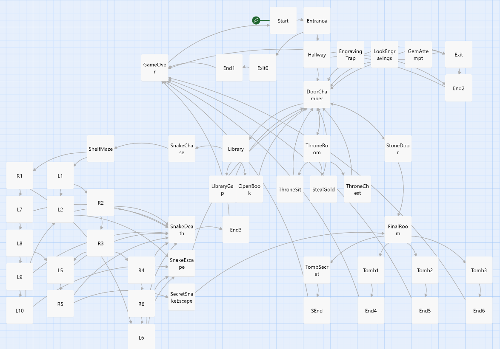
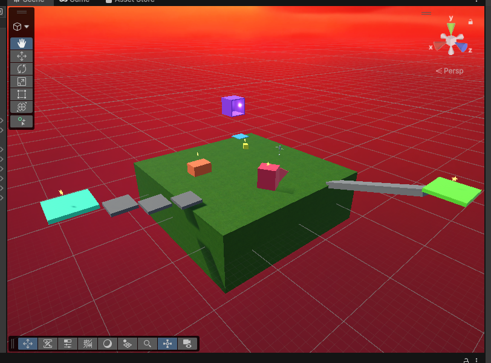

# Week 1 - Make A Thing: The Tomb of Many Ends

## Initial Brainstorm
First, I knew that I wanted to use Twine because I had never used it before, but it seemed unique and fun. Then, I tried brainstorming a theme/idea/story to try to implement in Twine. I kept going back to theme's I had already tried before and didn't like any of them because I really wanted to try something new. I ended up using a topic randomizer website until I found something that inspired me. I saw the word Mummy and instantly thought of Indiana Jones and thought of like old tomb exploration and so that is what I went with. Knowing that the goal was not to make something perfect but simply to make something complete helped me commit to an idea and move forward. 

At first, I thought about simply adding an inventory mechanic. At the start of the game, you would select 2 or 3 items out of a handful of options. Some interactions would be successful if you have the right tool(s) and some would be not even available if you didn't select the item at the start. I found a [simple inventory guide](https://twinelab.net/simple-inventory/#/) online that was pretty easy to follow along to.

However, this felt really boring. An inventory is so basic and has been done so many times before. So I kept thinking. Since I am the type of player that wants to interact everything, I thought it could be fun to play around with that. I decided to add a "curiosity level" which increases based on what you interact with and what you do. Different curiosity levels allow for different endings and interactions. 

Once I had all these main concepts down, I started planning it out on a piece of paper.I am a visual person when I brainstorm, so it allowed me to piece together my story in a way that made sense. I was able to plan out different paths and endings in a clear way for it to feel somewhat logical and coherent.

## Core Concept 
The final concept became a short interactive game set inside a tomb that reacts to the player’s curiosity. The core mechanic is a curiosity variable that increases when the player chooses to investigate objects, touch things, or explore deeper into the tomb. Rather than using combat or an inventory system, the game relies on choice-based progression and changing tone. The tomb itself becomes an observing presence that “remembers” the player’s actions and responds accordingly through text and events.

## Curiosity Level 
One of my main design goals was to make the experience somewhat counter-intuitive for certain players. As someone who typically wants to interact with everything in games, I found it interesting to design a system where curiosity is not always rewarded. High curiosity can lead to negative endings, such as being killed by the tomb or the snake, while more restrained play can result in safer outcomes. At the same time, high curiosity can also unlock a secret ending, where surviving the snake encounter leads to a hidden tunnel and a special reward. This allowed curiosity to feel risky rather than strictly good or bad.

I was able to create different endings and interactions based on "curiosity level" with lines like this:
 <<if $curiosity > 2 and $curiosity < 7>>
 [[...->Tomb1]]
 <</if>>

## Exploration and Learning 
Because this was my first time using Twine, much of the process involved learning how the tool works, especially how to use variables, conditionals, and passage structure in SugarCube. I found Twine to be surprisingly flexible and well suited for creating branching narratives and multiple endings with minimal mechanics. It allowed me to focus on writing, pacing, and player choice without needing complex systems. 

## Stupid Struggle 
As I was experimenting with different logic statements for the curiosity level, I kept going to playtest it and I kept seeing in grey <<if>> and <</if>>. I thought there was an error in what I was doing. I couldn't figure out what I was doing wrong for so long. I was honestly really frustrated and wanted to scrap the whole idea... then I tried the normal play button and everything was fine. I now know that those lines are visible specifically for playtesting and debugging, and it isn't an error... Whoops!

## Reflection
Overall, this project helped me become more comfortable working quickly, experimenting with unfamiliar tools, and accepting imperfection in early prototypes. Working within such a short timeframe forced me to prioritize finishing something playable rather than over-polishing individual elements. This helped reduce my usual tendency to get stuck refining ideas instead of moving forward.
Using Twine for the first time also changed how I thought about game structure. Because the tool is text-based and relatively simple, it encouraged me to think more carefully about player choice, pacing, and consequence rather than relying on complex mechanics. I found that even small systems, like a single curiosity variable, could meaningfully shape the player’s experience and lead to multiple outcomes.
Moving forward, I’m interested in continuing to experiment with simple mechanics that have layered narrative consequences, as well as expanding on some of the ideas introduced in this game, such as environmental storytelling and multiple endings. 

One way I thought about improving it would be to simply add music to create a slightly more immersive experience. When I was planning out the adventure, I had also thought of adding a trap room between the stone door and the final room. In this room, the player would have to use clue to make their way across trapped tiles that could help or end their playthrough. Due to time and the actual scope of this project, I decided not to add it for now.

Anyways, I am pretty proud of the end result and I think it is an interesting Make A Thing project.

# Week 2 - Exploration Prototype 1 

Due to some small technical issues during the class, we were just told to play around with Unity and to learn to be comfortable using it. 

Since I did not know where to start and I had never used Unity before, I decided to find a basic tutorial to follow. I found that Unity offered many tutorials with [Unity Learn](https://learn.unity.com/?signup=true). I decided to follow a basic tutorial, one of the first ones I saw. 

The tutorial explained what each window does, how to move around the interface, how to create objects, apply materials and effects, set up lighting, and make simple moving objects. Overall, it felt pretty well rounded and gave a good overview of the engine rather than focusing on one specific feature.

I did not know what to expect but turns out it is similar to Unreal Engine in many ways. In cegep, I had a few classes where we learned how to use Unreal Engine so it felt familiar. This made the learning process feel less intimidating and helped me feel more confident navigating Unity. Even though I didn’t create a full prototype this week, this exploration helped me better understand how Unity is structured and how different elements work together inside the engine. Getting familiar with the interface, hierarchy, and basic workflows felt important before attempting anything more complex. It also made me realize how much time can be saved by using tutorials as a starting point rather than trying to figure everything out on my own.

Overall, this week felt more like laying groundwork than producing something finished. While it was less creative than the previous assignment, it helped me feel more prepared to use Unity in future weeks and made the idea of building something from scratch in the engine feel more achievable.