# Week 1 - Make A Thing: The Tomb of Many Ends

### Initial Brainstorm
First, I knew that I wanted to use Twine because I had never used it before, but it seemed unique and fun. Then, I tried brainstorming a theme/idea/story to try to implement in Twine. I kept going back to theme's I had already tried before and didn't like any of them because I really wanted to try something new. I ended up using a topic randomizer website until I found something that inspired me. I saw the word Mummy and instantly thought of Indiana Jones and thought of like old tomb exploration and so that is what I went with. Knowing that the goal was not to make something perfect but simply to make something complete helped me commit to an idea and move forward. 

At first, I thought about simply adding an inventory mechanic. At the start of the game, you would select 2 or 3 items out of a handful of options. Some interactions would be successful if you have the right tool(s) and some would be not even available if you didn't select the item at the start. I found a [simple inventory guide](https://twinelab.net/simple-inventory/#/) online that was pretty easy to follow along to.

However, this felt really boring. An inventory is so basic and has been done so many times before. So I kept thinking. Since I am the type of player that wants to interact everything, I thought it could be fun to play around with that. I decided to add a "curiosity level" which increases based on what you interact with and what you do. Different curiosity levels allow for different endings and interactions. 

Once I had all these main concepts down, I started planning it out on a piece of paper.I am a visual person when I brainstorm, so it allowed me to piece together my story in a way that made sense. I was able to plan out different paths and endings in a clear way for it to feel somewhat logical and coherent.

### Core Concept 
The final concept became a short interactive game set inside a tomb that reacts to the player’s curiosity. The core mechanic is a curiosity variable that increases when the player chooses to investigate objects, touch things, or explore deeper into the tomb. Rather than using combat or an inventory system, the game relies on choice-based progression and changing tone. The tomb itself becomes an observing presence that “remembers” the player’s actions and responds accordingly through text and events.

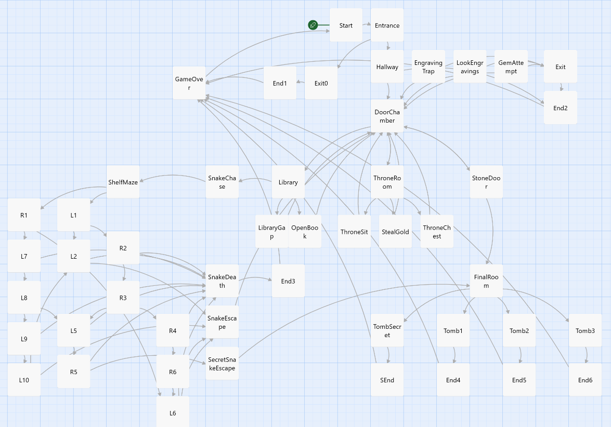

### Curiosity Level 
One of my main design goals was to make the experience somewhat counter-intuitive for certain players. As someone who typically wants to interact with everything in games, I found it interesting to design a system where curiosity is not always rewarded. High curiosity can lead to negative endings, such as being killed by the tomb or the snake, while more restrained play can result in safer outcomes. At the same time, high curiosity can also unlock a secret ending, where surviving the snake encounter leads to a hidden tunnel and a special reward. This allowed curiosity to feel risky rather than strictly good or bad.

I was able to create different endings and interactions based on "curiosity level" with lines like this:
 <<if $curiosity > 2 and $curiosity < 7>>
 [[...->Tomb1]]
 <</if>>

### Exploration and Learning 
Because this was my first time using Twine, much of the process involved learning how the tool works, especially how to use variables, conditionals, and passage structure in SugarCube. I found Twine to be surprisingly flexible and well suited for creating branching narratives and multiple endings with minimal mechanics. It allowed me to focus on writing, pacing, and player choice without needing complex systems. 

### Stupid Struggle 
As I was experimenting with different logic statements for the curiosity level, I kept going to playtest it and I kept seeing in grey <<if>> and <</if>>. I thought there was an error in what I was doing. I couldn't figure out what I was doing wrong for so long. I was honestly really frustrated and wanted to scrap the whole idea... then I tried the normal play button and everything was fine. I now know that those lines are visible specifically for playtesting and debugging, and it isn't an error... Whoops!

### Reflection
Overall, this project helped me become more comfortable working quickly, experimenting with unfamiliar tools, and accepting imperfection in early prototypes. Working within such a short timeframe forced me to prioritize finishing something playable rather than over-polishing individual elements. This helped reduce my usual tendency to get stuck refining ideas instead of moving forward.
Using Twine for the first time also changed how I thought about game structure. Because the tool is text-based and relatively simple, it encouraged me to think more carefully about player choice, pacing, and consequence rather than relying on complex mechanics. I found that even small systems, like a single curiosity variable, could meaningfully shape the player’s experience and lead to multiple outcomes.
Moving forward, I’m interested in continuing to experiment with simple mechanics that have layered narrative consequences, as well as expanding on some of the ideas introduced in this game, such as environmental storytelling and multiple endings. 

One way I thought about improving it would be to simply add music to create a slightly more immersive experience. When I was planning out the adventure, I had also thought of adding a trap room between the stone door and the final room. In this room, the player would have to use clue to make their way across trapped tiles that could help or end their playthrough. Due to time and the actual scope of this project, I decided not to add it for now.

Anyway, I am pretty proud of the end result and I think it is an interesting Make A Thing project.

# Week 2 - Exploration Prototype 1 

Due to some small technical issues during the class, we were just told to play around with Unity and to learn to be comfortable using it. 

Since I did not know where to start and I had never used Unity before, I decided to find a basic tutorial to follow. 
I found that Unity offered many tutorials with [Unity Learn](https://learn.unity.com/?signup=true). I decided to follow a basic tutorial, one of the first ones I saw. 

The tutorial explained what each window does, how to move around the interface, how to create objects, apply materials and effects, 
set up lighting, and make simple moving objects. 
Overall, it felt well-rounded and gave a good overview of the engine rather than focusing on one specific feature.

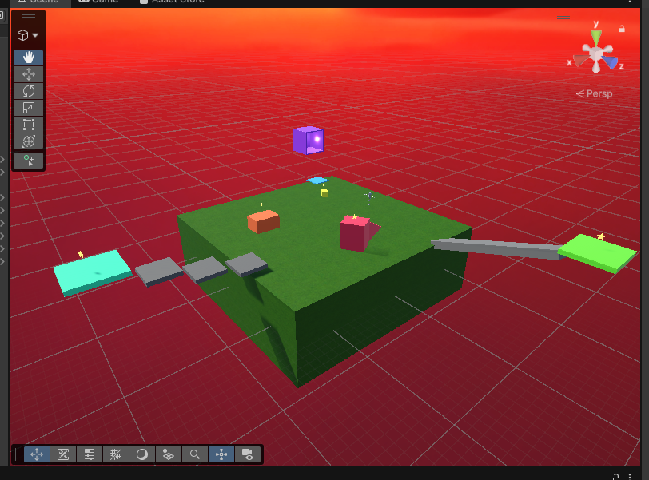

I did not know what to expect but turns out it is similar to Unreal Engine in many ways. In cégep, I had a few classes where we learned how to use Unreal Engine so it felt familiar. This made the learning process feel less intimidating and helped me feel more confident navigating Unity. Even though I didn’t create a full prototype this week, this exploration helped me better understand how Unity is structured and how different elements work together inside the engine. Getting familiar with the interface, hierarchy, and basic workflows felt important before attempting anything more complex. It also made me realize how much time can be saved by using tutorials as a starting point rather than trying to figure everything out on my own.

Overall, this week felt more like laying groundwork than producing something finished. While it was less creative than the previous assignment, it helped me feel more prepared to use Unity in future weeks and made the idea of building something from scratch in the engine feel more achievable.

# Week 3 - Exploration Prototype 2

In this week's class, we started with some theory on types of prototype and prototype fidelity. 
We then looked at "Gotta-Catcha-Mall" and the different scripts that handle the collisions, movement and points. 
We then explored how to transform those same basic mechanics to make Pong.

The goal this week was to think of a question you wanted to answer 
and to create a low fidelity prototype to explore this question/idea. 
I started by brainstorming ideas that I might want to explore.

### Brainstorm
I was feeling super sick all week so this is not my best, but I did try. At first, I wanted something simple enough to realistically complete, but still interesting from a design perspective. 
Since we were given a Pong-style base game, I thought it made sense to build on that rather than starting something entirely new. I kept thinking about how I could slightly disrupt a very familiar game without making it overly complicated.

I was drawn to the idea of unpredictability. Pong is normally very stable — the ball behaves exactly how you expect it to, 
and over time players can almost enter a rhythm. I became curious about what would happen if that stability slowly disappeared.

This led me to my core question:

How does unpredictability affect a player’s sense of control?
Would the game feel more exciting? More stressful? Less skill-based?

From there, the idea of the “UnpredictaPawg” emerged.

### Core Idea

The concept was to create a ball that mutates slightly every time it collides with something. Instead of behaving like a perfectly consistent physics object, the ball would gradually become harder to predict.

After each bounce, the ball randomly changes:

- speed 
- size 
- color 
- audio pitch

The goal was not to completely break the game, but to slowly add chaos while keeping it playable and true to the core of the game.

Because Pong is such a recognizable and minimal game, even small changes become very noticeable. 
I liked the idea that a tiny system adjustment could completely shift the emotional experience of playing.

### Process

Technically, the prototype was fairly straightforward, but it still involved some experimentation. 
I modified the existing ball script so that a mutation function would trigger on collision. 
This function slightly adjusts the ball’s speed within a safe range, rescales it, and randomizes its color and sound pitch.

One thing I learned very quickly is that physics can behave in unexpected ways. 
My first attempt resulted in a painfully slow ball that eventually stopped moving altogether. 
After some debugging, I realized I had mixed force-based movement with direct velocity changes, which caused the physics 
system to fight itself a little.

Switching to velocity-based movement immediately made the game feel more responsive and much closer to the classic Pong experience. 
It was a good reminder that sometimes the simplest technical approach is the strongest one, especially for arcade-style mechanics.

I also added limits to the speed and scale so the mutations would stay within playable boundaries. 
Without those constraints, the prototype could easily become frustrating rather than experimental.

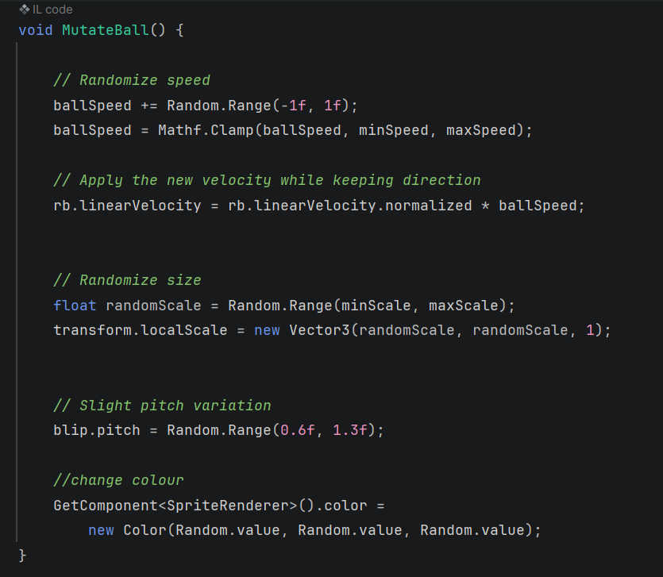

### Learnings

What I found interesting is that even though the change itself is small, it noticeably alters how the game feels. 
I didn’t introduce new controls or complicated mechanics, but the experience became less predictable and boring.

This exploration reminded me that experimentation does not always mean adding more features. 
Sometimes modifying a very familiar system is enough to create a different experience. 
I tend to overthink / overcomplicate projects but due to the time limitations and my illness, it forced me to think more simply for once (I doubt this will last).

One success was keeping the scope under control. 
It would have been very easy to keep adding mutations, 
but I tried to stay focused on the original question instead of feature-creeping the prototype.

The biggest struggle was definitely the physics behavior early on. When the ball stopped moving, 
it was not immediately obvious why, and debugging physics is not always very visible. Once I identified the issue, though, 
the fix was simple and the prototype became much more stable.

Another small but important addition was the visual color change. It helps communicate to the player that something has shifted, 
making the mutations feel intentional rather than like a bug.o

### Reflection

Overall, this exploration helped me better understand how low-fidelity prototypes can answer very specific design questions. 
The project was not about making a polished game, but about observing how one variable could reshape player experience.

If I were to continue exploring this idea, I might experiment with gradual instability, where the mutations become more extreme the longer a rally lasts. 
This could create a clearer arc of tension within each round. I could also imagine giving players limited ways to influence 
the chaos, such as a temporary stabilizing paddle or a mechanic that resets the ball. 
That might introduce an interesting balance between control and disorder.

Overall, I am happy with how this prototype turned out. It feels like a strong example of 
how a very small system can meaningfully transform a classic game while still remaining simple to implement. 
More importantly, it helped me become more comfortable modifying existing mechanics instead of feeling 
like I always need to invent something entirely new.

# Week 4 - Exploration Prototype 3: Emergent Grow System

### Initial Idea

This week I wanted to explore the idea of creating a simple system that could grow on its own. 
I was interested in how rule-based environments can evolve over time, and how even minimal mechanics can produce unexpected visual patterns. 
My focus was less on building a traditional game and more on observing emergent behavior from a structured grid.

Going into this prototype, I set an important constraint for myself: keep it low fidelity for like any visual or gameplay and lean towards a more system-focused approach. 
Rather than worrying about polish or presentation, I wanted to test whether the mechanic itself felt interesting to watch and interact with.

### Core Concept
The prototype consists of a 8x8 grid of circular tiles that gradually fill over time. 
Each empty tile periodically checks its neighbors to determine whether it should grow.

The system follows a few simple rules:
- If a tile has neighbors, it has a higher chance of growing 
- If it has no neighbors, growth is still possible but less likely 
- New tiles inherit nearby colors most of the time 
- Occasionally, a mutation occurs and introduces a new color

The result is a board that slowly transforms into an organic-looking mosaic without direct player control.

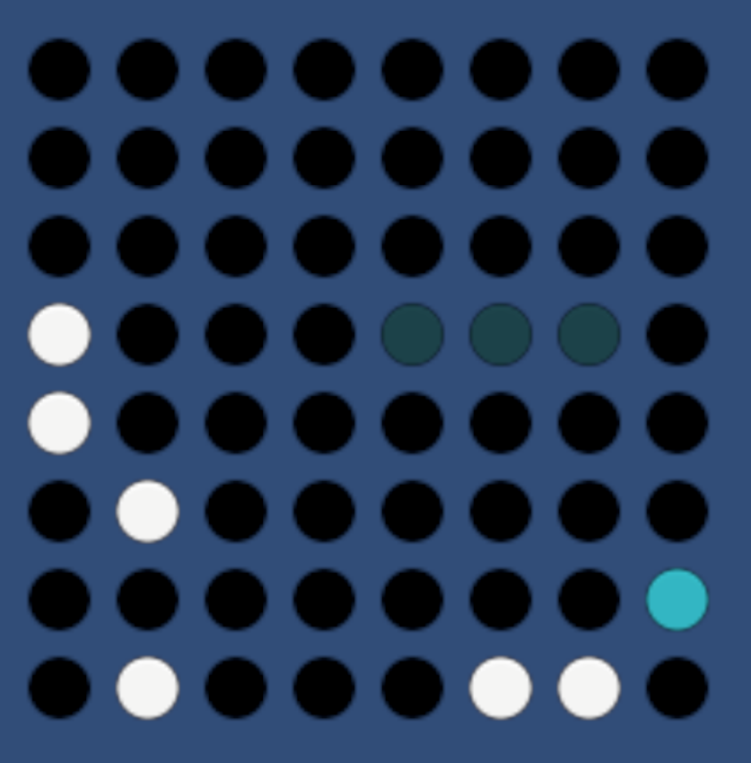 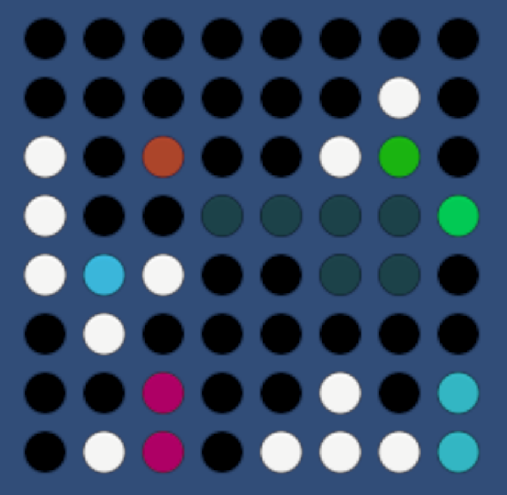 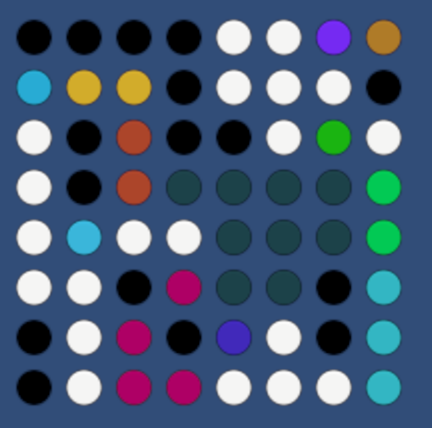

What interested me most was how something visually complex could emerge from extremely basic logic.

### Process

I approached this prototype in stages to avoid overwhelming myself.
First, I focused only on generating the grid and making tiles switch between empty and filled states. 
I also timed the growth so that the board would update automatically, making it feel more calm and alive.

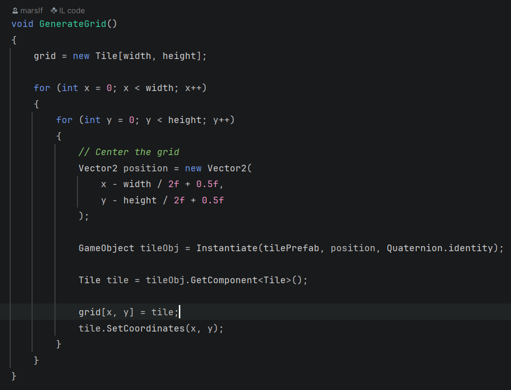

After that, I introduced color inheritance and mutation. Neighboring tiles now influence the color of new growth, 
but there is still a small randomness factor that prevents the grid from becoming too uniform.
Breaking the prototype into these smaller steps made the process much more manageable and helped me stay focused on testing one idea at a time.

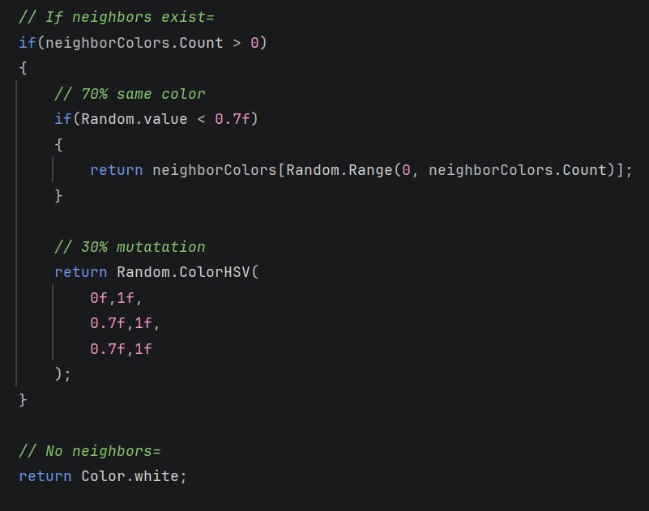

### Struggles
One feature I attempted but could not fully resolve this week was allowing the player to click tiles to delete them.
While the logic itself was not extremely complex, debugging the interaction started pulling my attention away from the core system. 
Since this is still an early prototype, I made the decision to prioritize a working growth mechanic rather than getting stuck on one interaction.
The clicking mechanic is something I would absolutely revisit in a future iteration. 
A part of my initial idea was that the user could interact by deleting the tiles to try to influence the grid, 
but they would still be forced to accept a level of randomness / emergence. They would have to accept only having a little bit of power of the pattern that could emerge.

### Learning
This prototype reinforced how powerful simple systems can be. 
Watching the grid slowly populate revealed patterns that I did not explicitly design but that naturally emerged from the rules.
It also made me realize that not every experience needs to be fast-paced. 
The slower spawn interval created a  calm atmosphere where the person is forced to observe instead of act.

I often tend to overcomplicate my projects, so this was a helpful exercise in restraint. 
By limiting the scope, I was able to build something functional while still exploring a meaningful design question.
Another important takeaway was learning when to move on from a problem. 
Instead of getting stuck trying to fix the clicking mechanic, I chose to protect the momentum I had going. 

### Reflection

Overall, this prototype helped me better explore simple rules to create larger systems.
What began as a very minimal idea, tiles growing based on their neighbors, turned into something visually engaging to watch. 
As the grid filled in, clusters of color started forming naturally, and no two runs ever looked exactly the same. 
It reinforced the idea that emergence does not require complicated mechanics; sometimes a few clear rules are enough.

I also found myself appreciating the slower pacing of the system. Unlike many games that prioritize constant interaction and speed, 
this prototype encourages a more passive form of observation. 
There is something calming about watching the grid gradually evolve rather than feeling pressured to act immediately. 
If I were to expand on this idea, I might intentionally lean into that atmosphere and treat it almost like a meditative or ambient experience.

As I previously mentioned, tne challenge I encountered was implementing the click-to-delete interaction. 
If I were to continue exploring this idea, I would first fix the tile interaction so players could influence the system directly. 
Allowing players to remove tiles would introduce a light layer of strategy, shifting the experience from pure observation toward gentle manipulation. 
I could also experiment with different mutation probabilities, growth speeds, or even rules where certain colors overpower others. 
Small adjustments like these could dramatically change the behavior of the system.

More than anything, this week helped me become more comfortable letting systems speak for themselves.
Overall, I see this prototype as a strong proof of concept and a reminder that experimentation often works best 
when it stays focused and intentionally small.

# Week 6 - Exploration Prototype 4: Emergent Grow System part 2

This week I really focused on added features and fixing certain parts of last week's prototype. 

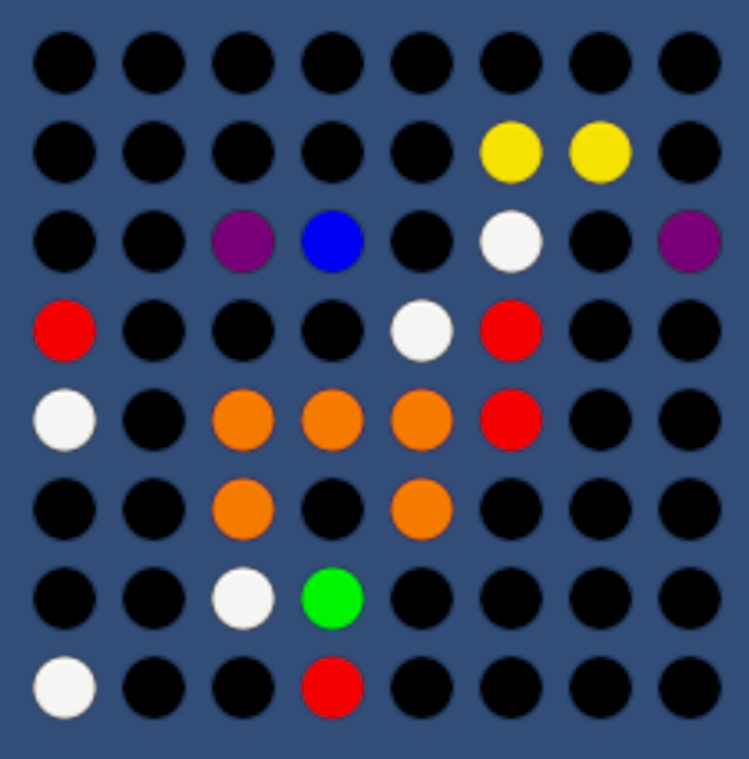

### Fixing Player Interaction 

I first went back to the clicking issue from last week because deleting the sprouts was not working properly. 
The main problem ended up being how the input was being handled.
I had some logic in GridManager before, but it wasn’t set up correctly with the Input System I’m using. 
I found a really helpful [Unity discussion post](https://discussions.unity.com/t/solved-detecting-mouse-click-on-an-object-in-2d-game/668634/7) 
that clarified how 2D mouse detection should work.

After reading through that, I adjusted the script and got left-click deleting working properly. 
Once that worked, I also added right-click to randomly place a color on whatever tile I clicked. 
That made the grid feel way more interactive immediately, since I could manually “seed” patterns instead of waiting for growth.

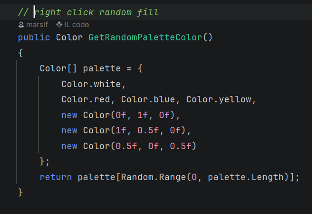

I also moved the mouse interaction logic out of GridManager.cs and into Tile.cs. 
Structurally it just made more sense because each tile is responsible for its own behavior. 
It cleaned up GridManager a lot and made the code easier to navigate.

### Limiting the Colour Palette

Originally, the colors were fully random using Random.ColorHSV(), which looked cool but was chaotic. 
It made patterns hard to read and didn’t really support intentional design. So I decided to limit the palette to only white (base), primary colours (red, blue, yellow), and secondary colours (green, purple, orange).

This made the system feel more controlled. Patterns became more readable, and it felt less like just chaotic noise.

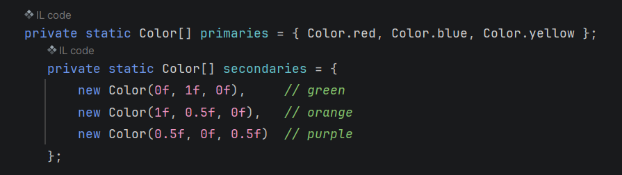

### Tiered Mutation Logic

After that, I decided to try to implement a tiered mutation system to replace the randomness and once again make it feel more intentionally designed. 
This is honestly the addition I am happiest with in this iteration of this prototype.

The idea/logic was:
* White (level 0) can spread white or mutate into a primary colour (level 1)
* Primary colours (level 1) can spread themselves or mutate to a secondary colour (level 2)
* Secondary colours (level 2) stay as they are (no mutation for now)

I adjusted how growth checks neighbours so that mutation feels influenced by nearby tiles instead of appearing randomly across the grid.
There were a few small minor debugging issues along the way, but fixing those helped me understand the structure of the script more clearly.

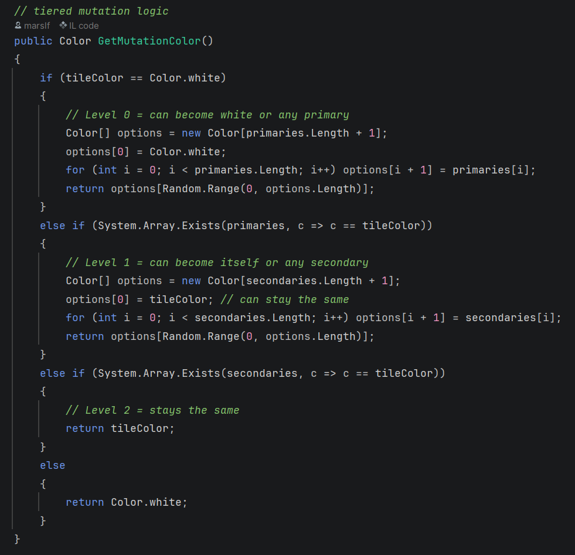

### Reflection
This week felt very iterative. I really just focused on refining what was already there and make the prototype feel more cohesive as a whole. 
At the start my focus was really figuring out the mouse clicking and making that and, and it was honestly a little frustrating at first.
However once that was resolved, I was really motivated to add more and found it fun!
I am happy with this exploration prototype because I was able to get it to a point where it feels like a small system with its own unique internal rules. 
I am especially happy with the tiered mutation idea because it makes the spread logical and predictable. 
It also makes it feel more controllable without removing emergence completely. 

One super minor change I could make if I were to make another iteration, now that I am reflecting, 
is to speed up the growth, although I do kind of like the slowness and meditative aspect of it, and also to push the mutation logic even further.
I am still overall pretty happy with this prototype.

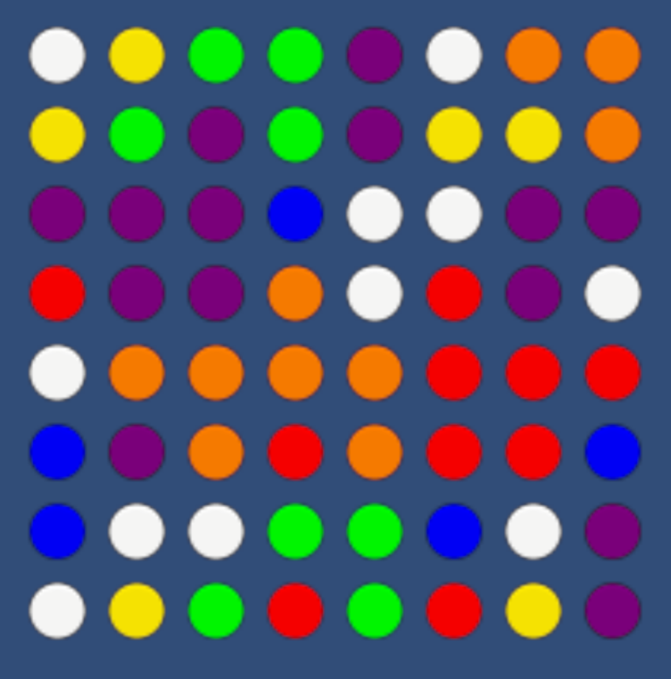
<<<<<<< HEAD

# Week 7 - Iterative Prototype 1: Conceptualizing 

### Initial brainstorm

During our last class, we had our ideation workshop. 
It was lowkey very fun, and we were able to come up with ideas I would have never come up with on my own. 
We first started writing down the ideas we had on our own.
I had some ideas in mind of general concepts that I haven't really played around with in past projects, but they weren't super fleshed out or anything. 
The first concept was to do something related to like a desert (temple maybe) type of game because I did make for the Make A Thing assignment week 1 a desert temple themed Twine short story game, [The Tomb of Many Ends](https://github.com/marslf/cart315/blob/main/Process/journal.md#week-1---make-a-thing-the-tomb-of-many-ends).
The second theme/concept I was interested in was to make something related to fish or being underwater. Maybe something like a fish who was raised on land who wished to explore the sea but was afraid of this unknown world.
I kept thinking and the third idea I came up with was to make some sort of puzzle game (maybe desert themed?) where the situation stays the same however the player's controls / abilities could change each time so that becomes the engaging variable in this situation. 

I want to focus on more intentional mechanics and let the theme / aesthetics be a secondary aspect of my project and neither of the first two ideas felt particularly interesting.
So I kept thinking... I am honestly really happy with my last two weeks of exploration prototyping. The base growth and mutation mechanic feels like a pretty strong foundation for a mechanically-interesting game.
Now time to talk to classmates to come up with fun hybrid ideas!

### Hybrid Time!

This part was really fun. I forced myself to not take it too seriously because once I do I stop myself from formulating initial ideas because they feel half-baked. However if I never formulate half-baked ideas, they can never have the chance of becoming something actually cool and fully-baked.

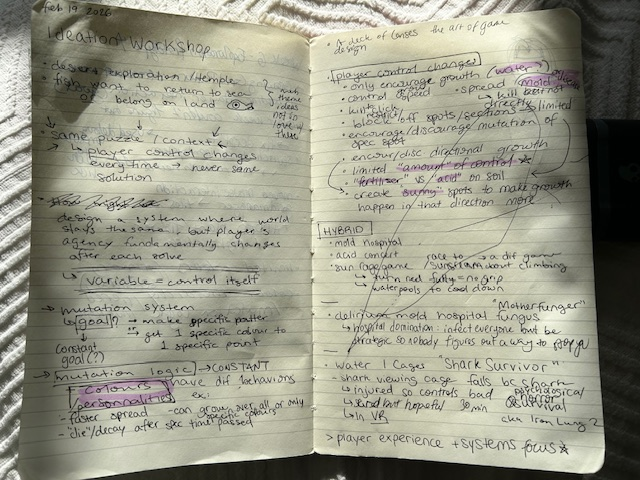

The first hybrid we came up with was _Sun Rage Game_. This concept kind of made us think of a game called _A Difficult Game About Climbing_ and we took inspiration from that. 
We came up with the idea of a game where the goal is to get to the sunscreen bottle while avoiding the sun to not get burned. 
There could be different types of obstacles and challenges to get to the sunscreen. 
However, the main mechanic we came up with was that you would get increasingly more red (burnt) and the more that increased, your strenght would equally decrease. 
We also thought of water pools to lower or reset how burnt you got so the level was not impossible.

The second hybrid we came up with was _Delirium Mold Hospital Fungus_. This idea took some light inspiration from the game _Plague Inc_. 
You, a fungus / mold, had the goal of taking over a hospital by infecting and killing everyone there. 
There would be different strategies and mechanics to use in order to win depending on your personal preference. 
You could increase your mortality rate and play really aggressively but then the hospital could like close off wings if things get too bad, 
or you could also play it slow and pace yourself to infect more people before becoming super deadly, however if you cause other symptoms people might start looking into the cause (you) and find a way to eliminate you.
You would be able to leave behind spores and multiply yourself, spread via the food, or become airborn or maybe be transmitted by a really busy nurse who saw many patients. 
This idea has a lot of potential for a lot of really cool and fun mechanics. We decided to name this idea _Mother Funger_.

The third and final hybrid we were able to come up with was _Water Cages_. The idea we came up with was more of an psychological horror _experience_ rather than a game. 
Your character will decide to go swim with sharks in those cage things (super optional life choice btw), however you decide to get the really good deal and go with the cheaper company. 
Unfortunately, they are not legit. 
A shark tries to attack and the cage detaches from the boat and so you plummet into the depths. 
You wake up in the cage at the bottom of the ocean/sea. You have an oxygen tank so your time is limited, but you believe they will come and save you.
Due to the fall, you are injured so the controls are bad and your vision is hazy. 
The shark is swimming around the cage, sometimes trying to take a bit. The whole time, you can hear your heartbeat pounding, getting louder and faster whenever the shark is near. 
You can try to throw stuff to hit or distract the shark, but he always comes back.
Your character remains scared but hopeful during the whole 30-minute experience (which could be done in VR mayhaps for extra horror). 
However, this event does not end well. No one is coming to save you. 

I really liked all three of these ideas but they just didn't really fit with what I had in mind. They could be revisited in the future though. 

### My Idea

After all the hybrids, I kept coming back to the mutation system I built over the past two weeks. 
It feels like there’s something there that I haven’t fully pushed yet. 
The growth, the limited palette, the tiered mutation logic, it already behaves like a small ecosystem. 
So instead of abandoning it and starting something totally new, I want to expand it and make it more intentional and elaborate. 
I also really liked the idea of the player's abilities / controls changing and thought combining the two ideas (hybrid-style) could be really interesting as well. 

Right now, in my prototype, the system grows and mutates based on its internal rules, and the player can add or delete tiles freely. 
But what if that freedom changes? 
What if the system stays the same, but the player’s ability to influence it changes? 

The goal of each level would be to get 1 specific colour to 1 specific point (or more than 1), or to create a specific pattern with the colours. 
I think I will focus on the mechanics and then experiment to see which of the two is more fun for the players (or I could always have both and just have it swap depeding on the level).
I am open to both goals, I want to test them both out and decide once I get to that point. 

Another idea I had was to change the mutation logic. I could keep the one I currently have for the first few levels and then have the changes (complications) be gradually introduced.
I really like the idea of the different colours each having their own logic or "personalities". The mutation logic is cool but I think the colours being more unique could create more engaging interactions and situations.
Some ideas I had for this were: 
- varying spreading speeds, 
- can't grow next to a specific colour, 
- can grow over a (or any) colour, 
- decaying after a certain amount of time has passed, 
- only grows diagonally or only horizontally/veritcally. 

As for the evolving player control, here are some of the ideas I came up with. Some of these overlap. The player: 
- can only encourage growth (with water),
- can control the spread speed of a colour,
- can cause instant decay
- can spread mold (indirectly causing decay in certain areas),
- can block off specific spots or sections (walls/fences),
- can use fertilizer or some sort of acid/anti-fertilizer,
- can encourage / discourage growth in a specific direction (by creating shaded or sunny spots),
- can only use abilities a limited amount of times.

### Prototyping

I decided to give planning my levels a shot to see the feel / difficulty increase of my game. 
I decided to make it go through phases so that the player does not feel super lost and they can gradually be introduced to newness. 
I planned 10 levels because I do have a tendency of creating a bigger scope than possible a lot of the time.
If I am successful in creating the 10 levels and I feel happy with them, I will definetly create more, I still have ideas I would love to implement that I have not included here.
I also decided to plan out the visuals for the level selection menu, which I have a really clear idea of what I want to do with it.
I want it to be reflective of the levels themselves.

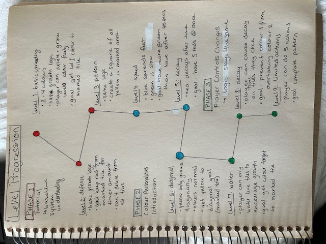

Another aspect I considered was the visuals of the tiles. The circles I am currently using are fine for prototyping, but I want it to have a different aesthetic.
My first ideas were flowers or mushrooms. I really like both but I wanted to think of other possibilities. In the same vibe, I could go with clovers or coral. 
I also thought about making something more science related or sci-fi, like cells or alien lifeforms. 
I didn't like either of these two last ideas, so I will probably go with something simple and nature-related.
But I am keeping an open-mind to any other ideas and I will see what feels right.

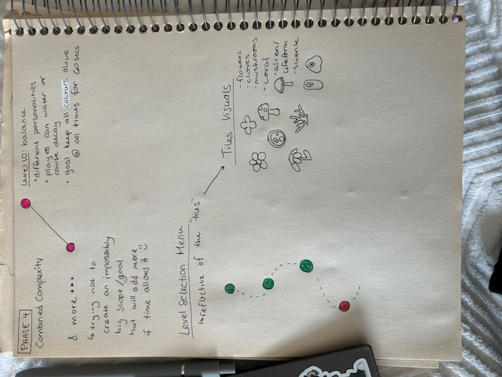

### What's next?

Now that I have a clearer direction, the next step is to actually start implementing instead of just ideating forever (which I could very easily keep doing).
The next step for me is to actually solidify the core mechanics before I get too deep into level building.

As much as I like planning out levels and progression, I know that if the base mutation logic isn’t strong enough, the levels won’t matter. 
So my priority is to implement the more complex colour “personality” logic first and really get that working properly. 
I want each colour to feel distinct and intentional rather than just being a different shade with the same behaviour. 
If I can get varying spread speeds, decay timing, directional growth, and interaction rules feeling clean and readable, I think the system will become way more interesting on its own.

After that, I want to experiment with grid size. 
Right now, I’m not fully convinced the current grid is the best scale. 
A smaller grid might make things feel tighter and more strategic, while a larger one could make the ecosystem feel more chaotic and alive. 
I might even change grid size depending on the level to control pacing and difficulty. 
I don’t want to lock myself into one format too early.

Implementing fully designed levels feels secondary for now. 
I’ll definitely test the mechanics using simple level setups (like single-goal scenarios), 
but I’m not going to obsess over polishing progression until I’m confident the system itself is fun. 
If the mechanics are strong, the levels will naturally become more interesting to design. 
If they’re weak, no amount of level structure will save them.

So overall:
1. Refine and expand mutation/personality logic. 
2. Implement goal / level-end logic 
2. Test different grid sizes. 
3. Use simple test levels to evaluate mechanics. 
4. Only then start committing to structured progression.

I’m trying to be more disciplined about building a strong foundation first instead of jumping ahead to aesthetics or over-scoping. 
If I can get the base system feeling solid and engaging, everything else will build much more smoothly from there.

# Week 8 - Iterative Prototype 2: Look/Feel focus

This week my brain honestly needed a break so I switched gears from the mechanics aspects (implementation prototyping) and 
pivoted to focus on the look/feel prototyping because I had been ignoring it for a while.

The first thing I worked on was experimenting with pixel art sprites for the tiles. 
Since I had only been using placeholder circle sprites so far, I wanted to start exploring what the actual aesthetic of the game might look like.
I used [Piskel](https://www.piskelapp.com/p/create/sprite/) to make them, which was also a bit of an experiment for me because I haven’t really worked in pixel art much before, especially not for games. 
help figure out a direction, I also made a small [inspiration board on Pinterest](https://pin.it/1IHh6RAth) so I could get a sense of the kind of styles and shapes I was drawn to.

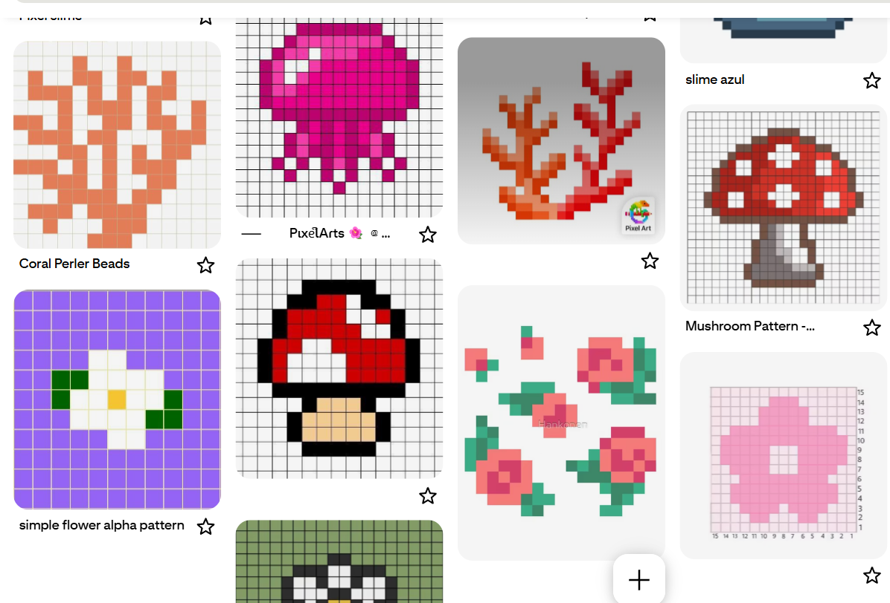

I ended up making a few different directions rather than committing to one immediately. The options I explored were: flower variations (single and cluster), coral, and mushrooms. 
I really like the nature theme, but I just don't know which nature theme specifically I want to stick to yet.
I saved and tested out my favourites, it was a lot of trial and error though since I had never tried out this style really. 
I think I will probably stick to the flower theme, but I also really liked how the coral sprite turned out / looked. 

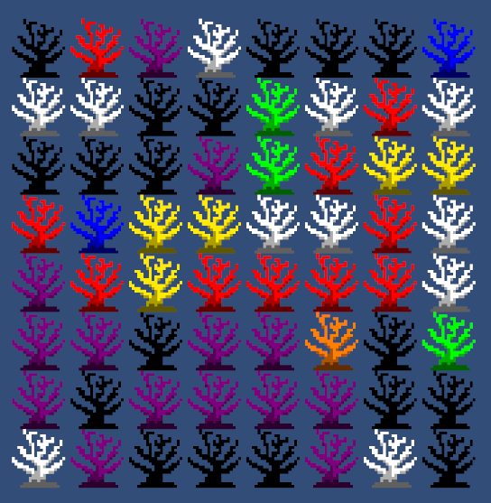
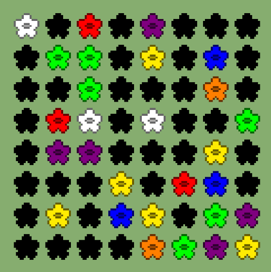

Right now I’m leaning toward the flower direction, but I’m not completely sold yet. 
I want to get some outside opinions and probably make a few more iterations before deciding. 
Something I did intentionally while making them was keep the sprites white / greyscale. 
This way the colours can be applied directly in Unity through the SpriteRenderer, meaning I only need one sprite asset and 
the system can recolour it dynamically depending on the tile state. 
This keeps things much simpler technically and also makes it easier to experiment visually.

I also spent some time thinking about a title for the game, even if it’s just a placeholder for now. 
The current working title is Bloom, but I also wrote down a few other options that I like such as Bloom Engine, Chroma Garden, and Petri Garden. 
I’m honestly not sure yet which direction fits the project best, so I’m planning on asking friends and classmates what they think before committing to anything.

Another thing I worked on was creating a main menu screen. 
Since the project is starting to take shape, I felt like it would be nice to start structuring it more like an actual game instead of just a prototype scene. 
I designed some pixel art UI elements including a title placeholder, Play button, Quit button, and a simple background (all using Piskel also).

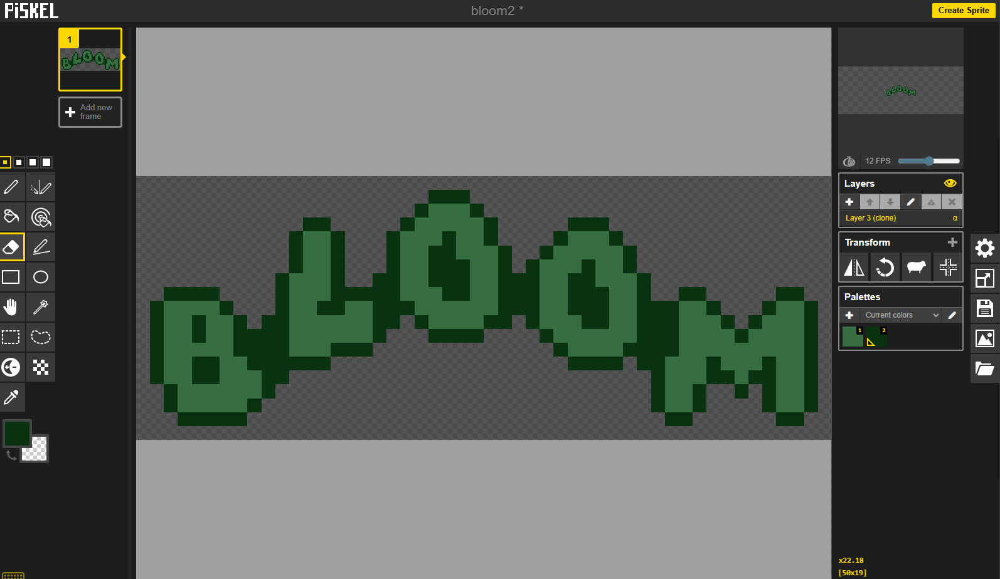

I then implemented the menu in Unity using a Canvas and wrote a small script to make the buttons functional. 
The Play button loads the next scene and the Quit button exits the game. 
I followed a short [YouTube tutorial](https://www.youtube.com/watch?v=zc8ac_qUXQY) to set this up since it was my first time building a menu system like this. 
I also found a [guide](https://medium.com/@Brian_David/scene-loading-in-unity-a-comprehensive-guide-for-creating-main-menus-ui-elements-842d8ed3d364) online on creating main menus and UI elements which was super clear, conscise and helpful!

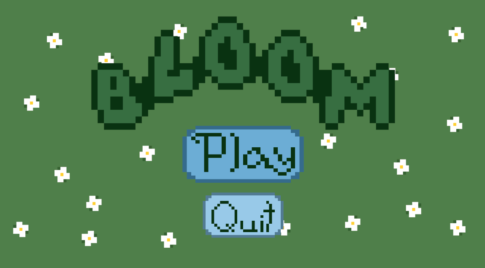

Even though this work was more visual than systemic, it still helped the project feel a lot more cohesive and game-like.

### Next Steps

For the next phase of the project I want to return to the mechanics side and push the system further. 
Two of the biggest priorities are implementing the more complex spreading/personality logic for the colours and creating the logic that detects when a level is completed.
Right now the mutation and growth system works, but it still feels pretty basic. 
I want to expand it so that different colours behave more distinctly and create more interesting interactions on the grid.

Another goal is to build the level selection screen, since the menu currently only has Start and Quit. 
Having a level select will make testing much easier and will also start structuring the game around the levels I planned around week 7.

Finally, I also want to keep exploring the visual direction of the tiles. 
The flower sprites are my current favorite, but before committing to them I want to show the different versions to friends and classmates and 
see which ones people respond to most. Depending on the feedback, I’ll either refine the flower idea further or try another direction entirely.

### Reflection

Even though this week wasn’t super focused on mechanics, I still feel like it was a really useful shift. 
I had been deep in the logic side of things for a few weeks and I could feel myself starting to get a bit stuck creatively/mentally. 
Switching to the visual side let me keep moving forward on the project without forcing myself to grind through code when my brain clearly needed a bit of a reset. 
It also helped me start seeing the project less like a technical prototype and more like an actual game.

Working on the pixel art was also interesting because it’s not something I usually do. 
I normally lean more toward illustration or other visual styles, so trying pixel art felt a bit unfamiliar at first. 
Making multiple directions instead of committing immediately helped a lot though. It made the process feel more exploratory and 
less like I needed to get it “right” on the first try. I also liked the decision to keep the sprites greyscale so 
Unity can apply the colours dynamically, because it keeps the system flexible while still letting me experiment with aesthetics.

Another thing that felt surprisingly motivating was just having a main menu. It’s a pretty small feature in terms of functionality, 
but seeing the project open to a start screen instead of jumping straight into a test scene made it feel a lot more like a real game. 
I think these small structural things help a lot with momentum because they make the project feel more cohesive and intentional overall.
